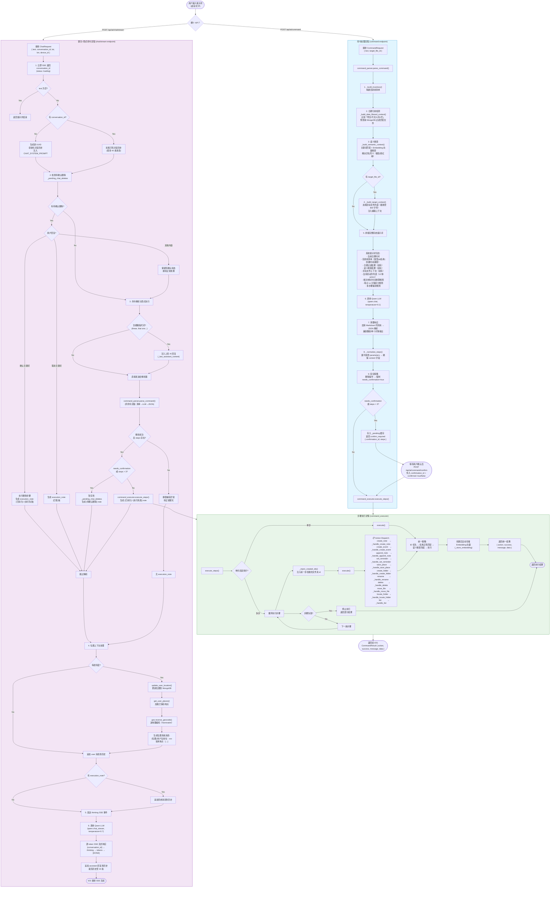
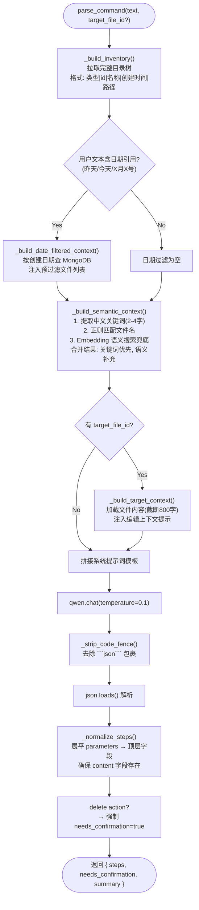
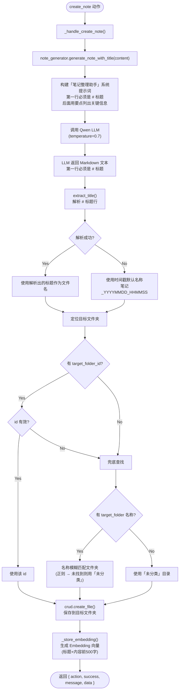
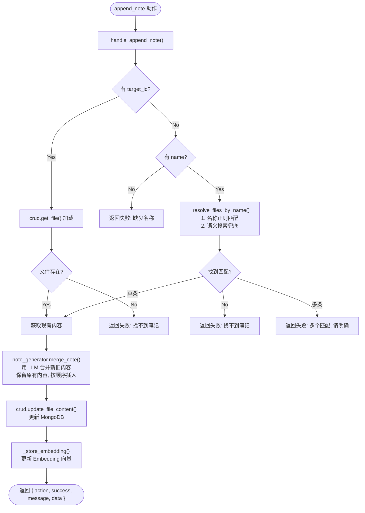
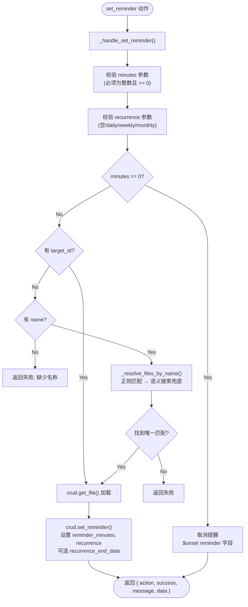
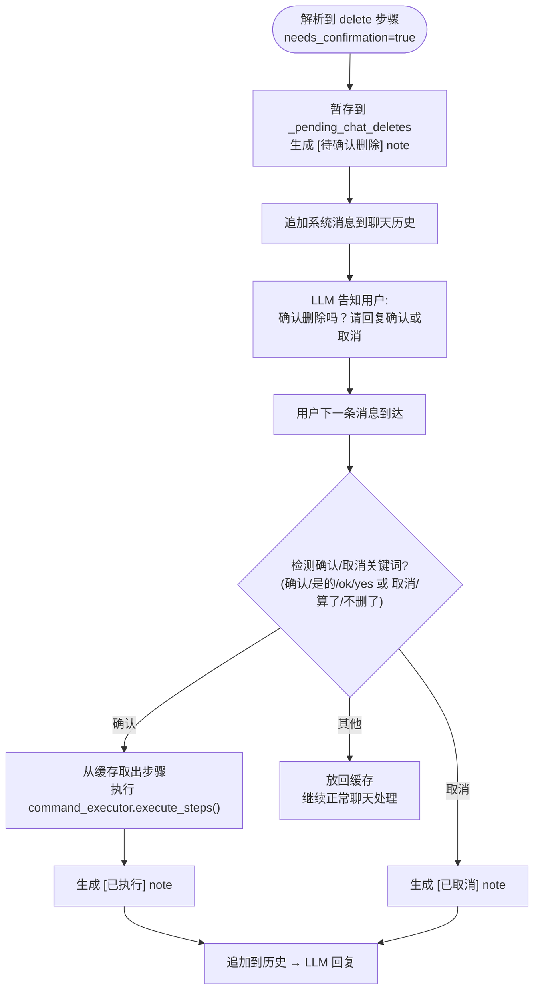

# SayMark AI 提示词处理流程

## 一、总体流程图

## 二、命令解析子流程 (command_parser)

## 三、创建笔记的详细子流程

## 四、补充笔记的子流程 (append_note)

## 五、设置提醒的子流程 (set_reminder)

## 六、删除确认子流程（聊天中的二次确认）

## 七、核心文件索引

| 文件 | 职责 |
|---|---|
| `backend/app/routers/ai.py` | API 路由：`/command`、`/command/confirm`、`/chat/stream`，对话历史管理，待确认缓存，删除二次确认，位置上下文注入 |
| `backend/app/services/command_parser.py` | 自然语言 → JSON 步骤（通过 LLM），含目录树构建、日期过滤、语义搜索、目标文件上下文注入 |
| `backend/app/services/command_executor.py` | 执行 JSON 步骤（MongoDB CRUD），支持 11 种 action，ID 优先 → 名称匹配 → 语义搜索兜底 |
| `backend/app/services/note_generator.py` | 语音转录 → Markdown 笔记（通过 LLM），含标题提取、内容合并 |
| `backend/app/services/qwen.py` | Qwen LLM 客户端（OpenAI 兼容，支持 chat/chat_stream/embed 三种模式） |
| `backend/app/services/geo.py` | 地理编码/逆地理编码（Nominatim），Haversine 距离计算 |
| `backend/app/crud.py` | MongoDB 数据访问层，含目录树、模糊匹配、语义搜索、提醒管理、用户 Profile、Embedding 存储 |

## 八、支持的 Action 完整列表

| Action | 说明 | 关键参数 |
|---|---|---|
| `create_note` | 新建笔记（无时间点的备忘） | content, target_folder_id? |
| `create_event` | 新建日程（有时间点的安排） | title, date(YYYY-MM-DD), time(HH:MM)?, content, target_folder_id? |
| `append_note` | 补充内容到已有笔记/日程 | target_id?, name?, content |
| `set_reminder` | 设置/取消提醒（支持周期） | target_id?, name?, minutes, recurrence?, recurrence_end_date? |
| `save_place` | 保存地点到个人地名库 | name, lat, lon |
| `create_folder` | 创建文件夹（幂等） | name, parent_folder_id?, parent_folder? |
| `rename` | 重命名文件/文件夹 | type(file|folder), target_id?, name?, new_name |
| `delete` | 删除文件/文件夹（强制二次确认） | type(file|folder), target_id?, name? |
| `move_file` | 移动文件到目标目录 | file_id?, file_name?, to_folder_id?, to_folder? |
| `locate_folder` | 定位文件夹 | target_id?, name? |
| `list` | 列出目录内容 | target_folder_id?, path? |

## 九、关键设计决策

1. **两步路由**：`/command` 用于显式指令（有确认机制），`/chat/stream` 用于对话+隐式执行（静默处理失败）。
2. **目录树注入**：LLM 直接看到真实目录树的 id，通过语义选择目标，而非事后字符串匹配。
3. **日期预过滤**：用户提到「昨天/今天/X月X号」时，后端预先查 MongoDB 过滤匹配文件，避免 LLM 幻觉。
4. **语义搜索兜底**：当名称字面匹配失败时，用 Embedding 向量搜索异名同义的内容（如「番茄/西红柿」「购物相关/超市清单」）。
5. **Embedding 存储**：每次创建/更新笔记后自动生成 Embedding 向量存储到 MongoDB，供后续语义搜索使用。
6. **删除二次确认**：所有删除操作强制 `needs_confirmation=true`，在聊天中通过自然语言确认（而非 API 确认）。
7. **笔记与日程统一存储**：笔记（type=note）和日程（type=event）都存储在 MongoDB 的 files 集合中，日程额外有 date/time 字段。
8. **位置感知**：聊天接口接收经纬度，自动逆地理编码 + 加载用户常用地点，注入到 LLM 系统消息中。
9. **多步骤编排**：支持在一条指令中串联多个 action，前一步创建的文件夹 id 自动注入后续步骤。
10. **待确认缓存**：`/command` 端口的待确认步骤存内存 `_pending`，`/chat/stream` 的删除待确认存 `_pending_chat_deletes`。
