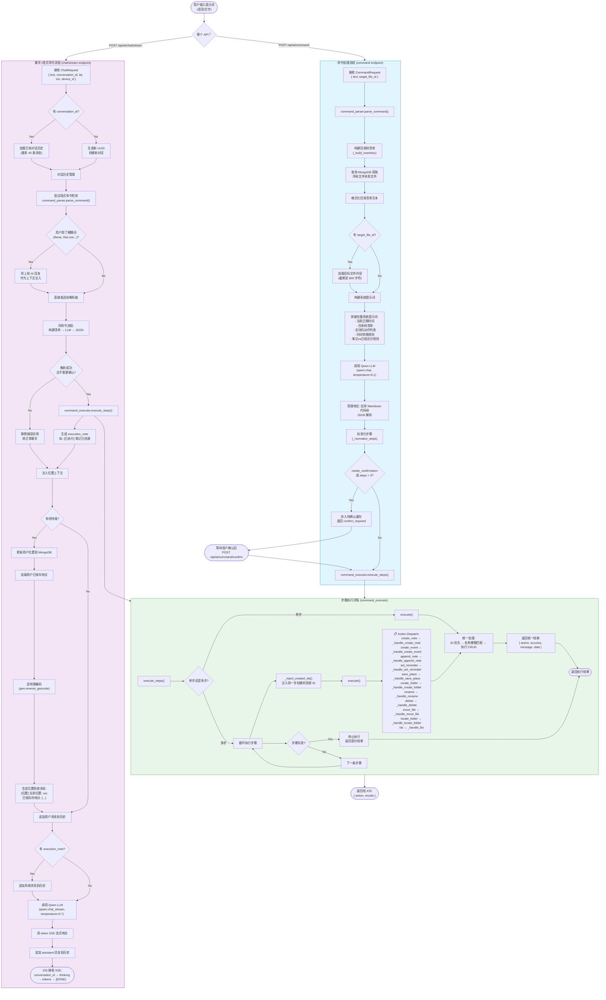
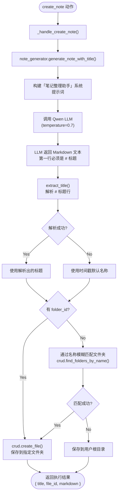

# SayMark AI 提示词处理流程

## 一、总体流程图

## 二、创建笔记的详细子流程

## 三、核心文件索引

| 文件 | 职责 |
|---|---|
| `backend/app/routers/ai.py` | API 路由: `/command`, `/command/confirm`, `/chat/stream` |
| `backend/app/services/command_parser.py` | 自然语言 → JSON 步骤 (通过 LLM) |
| `backend/app/services/command_executor.py` | 执行 JSON 步骤 (MongoDB CRUD) |
| `backend/app/services/note_generator.py` | 语音转录 → Markdown 笔记 (通过 LLM) |
| `backend/app/services/qwen.py` | Qwen LLM 客户端 (OpenAI 兼容, 支持流式) |
| `backend/app/services/geo.py` | 逆地理编码 (坐标 → 地址) |
| `backend/app/crud.py` | MongoDB 数据访问层 |
